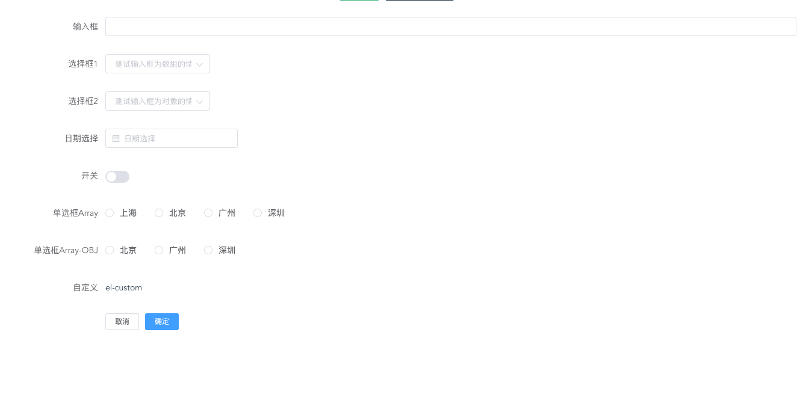

# el-form-shema

## 背景

目前使用 `elment-ui` 做表单查询的时候，会出现大量的重复工作和代码，目标期望的是使用一种 json 的形式渲染出表单做查询。

## 引入

```javascript
import FormsShema from "elFormSchema";
Vue.use(FormsShema);
```

```html
<template>
  <el-form-shema
    :schemas="schemas"
    v-model="formValues"
    :config="config"
    @submit="handleSubmit"
  ></el-form-shema>
</template>

<script>
  export default {
    data() {
      return {
        config: {
          labelWidth: "180px"
        },
        schemas: [
          {
            tag: "el-input",
            props: {
              size: "small",
              placeholder: "测试输入框"
            },
            events: {
              blur() {}
            },
            rule: [],
            model: "name",
            label: "输入框"
          },
          {
            tag: "el-select",
            props: {
              size: "small",
              multiple: true,
              placeholder: "测试输入框为数组的情况"
            },
            events: {},
            rule: [],
            options: [
              {
                value: "选项1",
                label: "黄金糕"
              },
              {
                value: "选项2",
                label: "双皮奶"
              },
              {
                value: "选项3",
                label: "蚵仔煎"
              },
              {
                value: "选项4",
                label: "龙须面"
              },
              {
                value: "选项5",
                label: "北京烤鸭"
              }
            ],
            model: "select1",
            label: "选择框1"
          },
          {
            tag: "el-select",
            props: {
              size: "small",
              placeholder: "测试输入框为对象的情况"
            },
            events: {},
            rule: [],
            options: {
              1: "选项1",
              2: "选项2",
              3: "选项3"
            },
            model: "select2",
            label: "选择框2"
          },
          {
            tag: "el-date-picker",
            props: {
              size: "small",
              placeholder: "日期选择"
            },
            events: {},
            rule: [],
            options: [],
            model: "picker",
            label: "日期选择"
          },
          {
            tag: "el-switch",
            props: {
              size: "small",
              placeholder: "日期选择"
            },
            events: {},
            rule: [],
            options: [],
            model: "switch",
            label: "开关"
          },
          {
            tag: "el-radio",
            props: {
              placeholder: "单选框"
            },
            events: {},
            rule: [],
            options: ["上海", "北京", "广州", "深圳"],
            model: "radio",
            label: "单选框Array"
          },
          {
            tag: "el-radio",
            props: {
              placeholder: "单选框"
            },
            events: {},
            rule: [],
            options: ["北京", "广州", "深圳"],
            model: "radio1",
            label: "单选框Array-OBJ"
          },
          {
            tag: "el-checkbox",
            props: {
              size: "small",
              placeholder: "复选框"
            },
            events: {},
            rule: [],
            options: ["上海", "北京", "广州", "深圳"],
            model: "checkbox",
            label: "复选框Array"
          },
          {
            tag: "el-custom",
            render: (h, p) => {
              return h("div", p.tag);
            },
            model: "custom",
            label: "自定义"
          }
        ],
        formValues: {
          name: "",
          select1: "",
          select2: "",
          picker: "",
          switch: "",
          radio: "",
          radio1: "",
          checkbox: "",
          checkbox1: "",
          checkbox2: ""
        }
      };
    },
    methods: {
      handleSubmit(data) {
        console.log(data);
      }
    }
  };
</script>
```

参数：

| First Header |                    Second Header                    |
| :----------: | :-------------------------------------------------: |
|   schemas    |                   渲染的组件对象                    |
|  formValues  | 渲染组件对象的 v-model(需要和选择对象的 model 重名) |
|    config    |       对象整理布局 参数为 el-form 中的 props        |

schemas 参数：

| First Header |         Second Header |                    Eg                     |
| ------------ | --------------------: | :---------------------------------------: |
| tag          |        渲染组件的名字 |                'el-input'                 |
| props        |      对应组件的 props | {size: "small",placeholder: "测试输入框"} |
| events       |        当前组件的事件 |                {click(){}}                |
| rule         |    当前组件的校验规则 |            [{required: true}]             |
| model        |    当前组件的 v-model |                                           |
| label        | 当前组件的 label 名称 |                  '测试'                   |
| render       |  当前组件的自定义渲染 |                 Function                  |

## 效果


